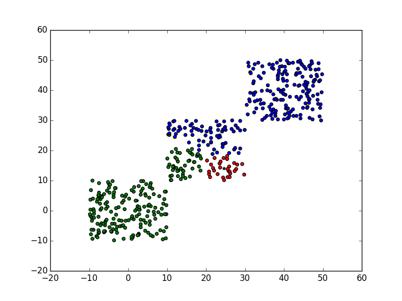
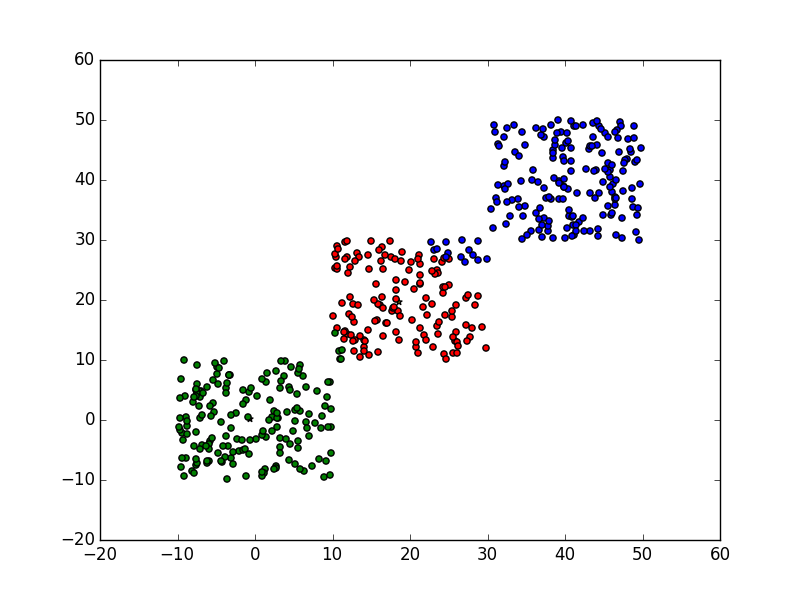

# parallel-kmeans
Implemente kmeans algorithm with MPI and multi-thread manners.  
* Using MPI to implemente K-means algorithm, you can get more details in directory mpi-kmeans.  
* Using posix_thread to implemente K-means algorith, these codes are stored in multi-thread-kmeans.  

## visualization of algorithm for random generated data  
In this experiment, I generated centroids for three clusters. Then randomly generated 500 points, each  
point randly belog to one cluster, then generate a distance to this centroid.  
Using the implemented mpi-kmeans to cluster these data, for every iteration, save the out of kmeans as 
a png file. The result is showd below.  

  
  
  

